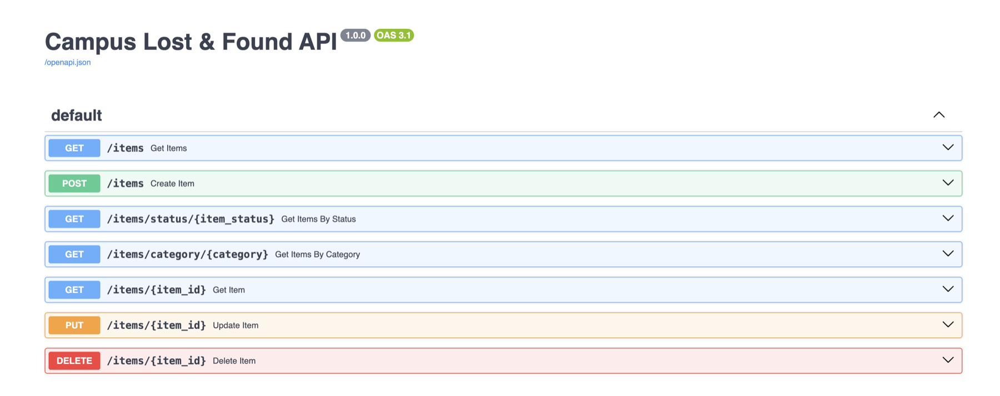
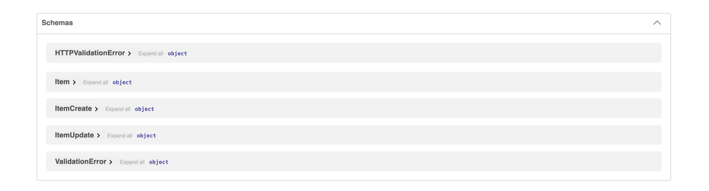
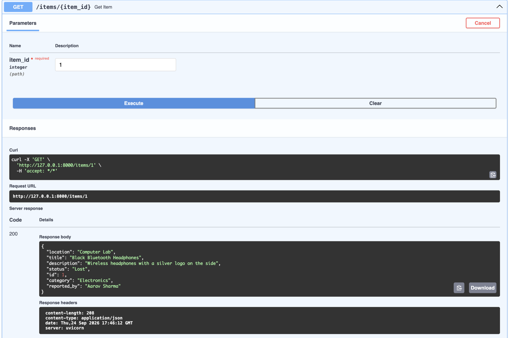
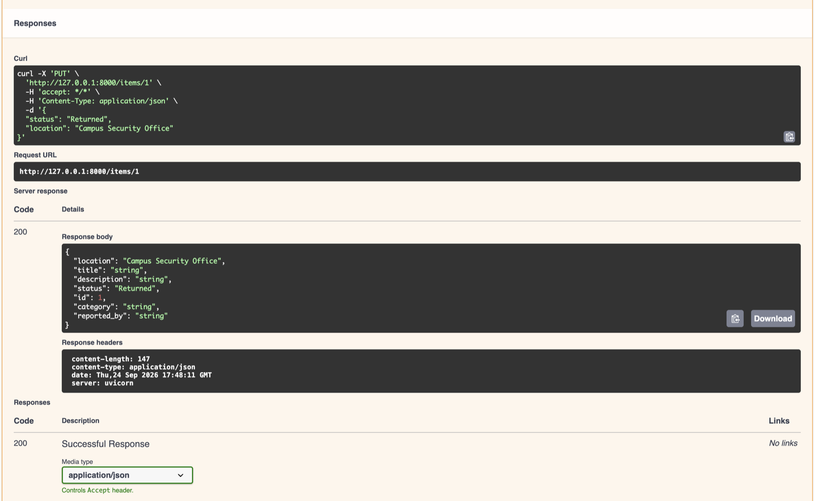
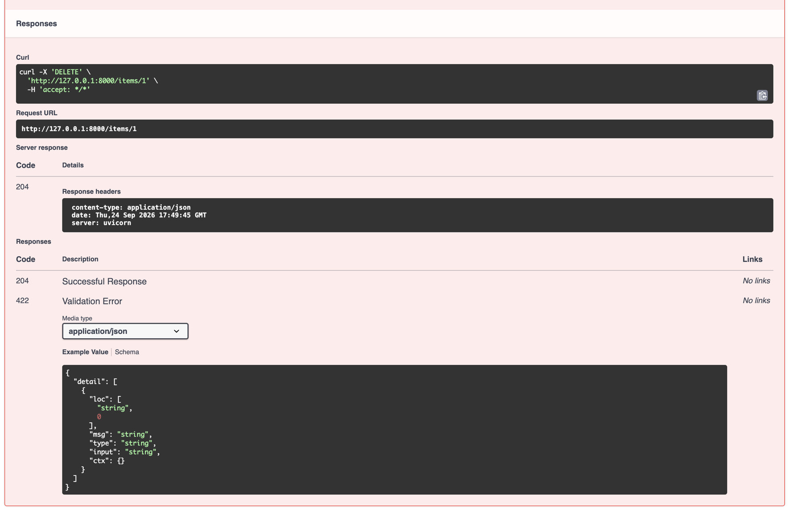

# Campus Lost & Found API

A REST API for reporting and managing items lost or found on a college campus. It stores item reports in SQLite and supports searching, filtering, updating, and deleting reports.

## Technologies

- Python
- FastAPI
- SQLModel
- Pydantic
- SQLite
- Uvicorn

## Installation

From the project folder, create and activate a virtual environment, then install the dependencies:

```bash
python3 -m venv .venv
source .venv/bin/activate
python -m pip install --upgrade pip
pip install -r requirements.txt
```

The database and `item` table are created automatically when the application starts. To add the sample items to a new or existing database, run:

```bash
python -m app.seed
```

The seed command is safe to rerun; it adds only sample items that are missing.

## Run the Application

From the project folder, with the virtual environment activated:

```bash
uvicorn app.main:app --reload
```

## Swagger UI

Open [http://127.0.0.1:8000/docs](http://127.0.0.1:8000/docs) after starting the application.

## Available Endpoints

| Method | Endpoint | Description |
| --- | --- | --- |
| `POST` | `/items` | Create a lost or found item report. |
| `GET` | `/items` | List all item reports. |
| `GET` | `/items/{item_id}` | Get one report by ID; returns 404 when it does not exist. |
| `PUT` | `/items/{item_id}` | Update fields on an existing report. |
| `DELETE` | `/items/{item_id}` | Delete a report. |
| `GET` | `/items/status/{item_status}` | Filter reports by `Lost`, `Found`, or `Returned`. |
| `GET` | `/items/category/{category}` | Filter reports by category. |

`POST` and `PUT` validate required text fields and accept only `Lost`, `Found`, or `Returned` as a status.

### Example request bodies

Use this JSON with `POST /items` to create a report:

```json
{
  "title": "Blue water bottle",
  "description": "Insulated bottle left in the library study area.",
  "category": "Bottle",
  "location": "Main Library",
  "reported_by": "Aarav Sharma",
  "status": "Lost"
}
```

Use this JSON with `PUT /items/{item_id}` to update only selected fields:

```json
{
  "location": "Library reception",
  "status": "Found"
}
```

## Screenshots

Swagger UI endpoint list and the available schemas:





Successful item lookup, update, and delete examples:







The supplied `post-request.png` depicts a different API, so it is excluded from the GitHub files. Replace it with a screenshot of a successful `POST /items` request before submitting if your assessment requires a POST screenshot.
